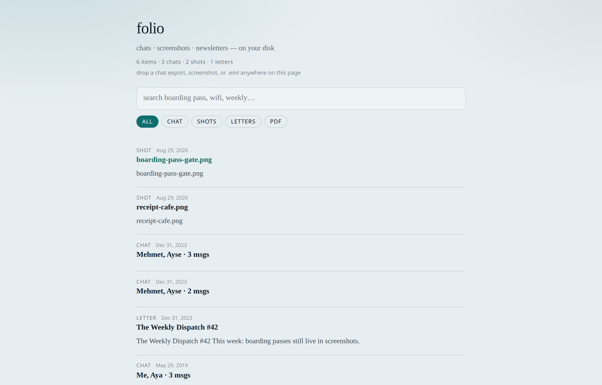
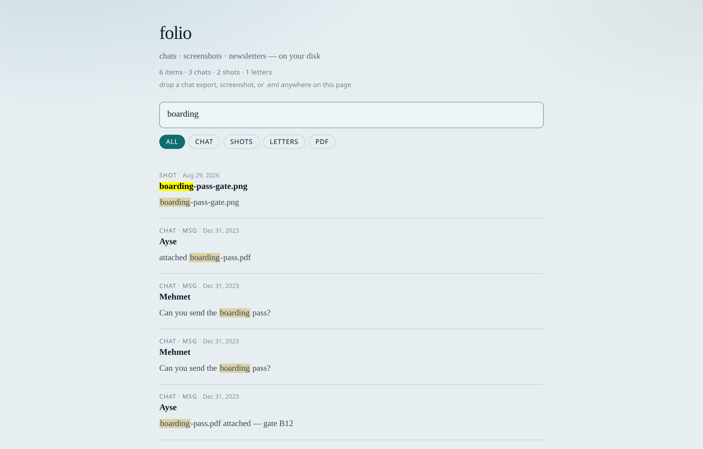
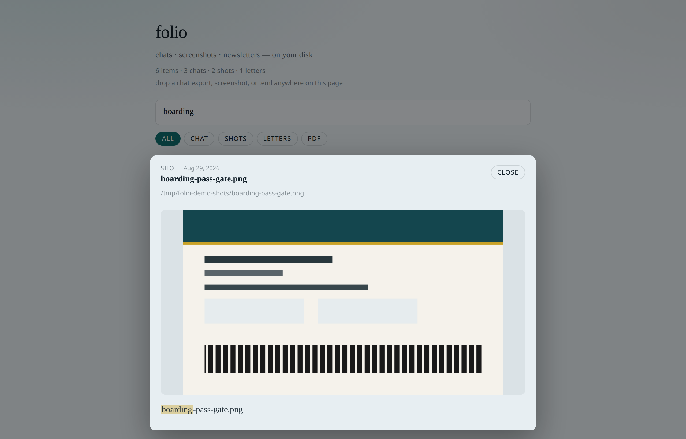

# folio

<p align="center">
  <a href="README.md">English</a> · <strong>Türkçe</strong>
</p>

<p align="center">
  <a href="https://github.com/mturac/folio/releases/latest"></a>
  <a href="LICENSE"></a>
  <a href="https://github.com/mturac/folio/actions/workflows/ci.yml"></a>
  
</p>

<p align="center">
  <strong>Sohbetler. Ekran görüntüleri. Bültenler. Aranabilir. Diskinde.</strong><br />
  Hesap yok. Bulut yok. Tek binary.
</p>

<p align="center">
  
</p>

---

## Neden folio

Boarding pass ekran görüntüsünde. Wifi kodu WhatsApp dışa aktarımında.
Geçen haftanın bülteni Downloads’ta bir `.eml`. Folio bunları yerelde
indeksler — terminalde veya makineden çıkmayan küçük bir okuma odasında
yeniden bulursun.

| Sen tutarsın | Folio yapar |
| --- | --- |
| Diskteki dosyalar | Tam metin arama (SQLite FTS) |
| Mesajlaşma dışa aktarımları | Mesaj düzeyinde sohbet indeksi |
| Ekran görüntüleri | Tesseract kuruluysa OCR |
| Gizlilik | Yalnızca localhost arayüz · telemetri yok |

---

## 60 saniye

```bash
curl -fsSL https://raw.githubusercontent.com/mturac/folio/main/install.sh | bash
folio init
folio ingest chat ~/Downloads/WhatsApp\ Chat.zip
folio ingest shots ~/Desktop/Screenshots
folio serve --open
```

Tarayıcıda ara, ya da dosyayı sayfaya bırak.

<p align="center">
  
</p>

macOS, Linux ve Windows için hazır binary’ler
[Releases](https://github.com/mturac/folio/releases) sayfasında.
Kurulum betiği önce release arşivini dener; yoksa `go install` kullanır.

---

## Okuma odası

`folio serve --open` localhost’ta bir arayüz açar:

- Vurgulu arama sonuçları
- chat · shots · letters · pdf filtreleri
- Öğeyi açınca tam gövde veya görsel
- Sayfadan çıkmadan sürükle-bırak ile ekleme

<p align="center">
  
</p>

Klavye: `j` / `k` gezin · `Enter` aç · `Esc` kapat.

---

## Kurulum

**Betik (macOS / Linux)**

```bash
curl -fsSL https://raw.githubusercontent.com/mturac/folio/main/install.sh | bash
```

**Go**

```bash
go install github.com/mturac/folio@latest
```

**Kaynaktan**

```bash
git clone https://github.com/mturac/folio
cd folio && make install
```

### İsteğe bağlı araçlar

| Araç | Ne için |
| --- | --- |
| [Tesseract](https://tesseract-ocr.github.io/) | Ekran görüntüsündeki yazıyı OCR |
| `pdftotext` (poppler) | PDF metni çıkarma |

Olmasa da dosya adları (ve formatın zaten taşıdığı metin) indekslenir.

```bash
# macOS
brew install tesseract tesseract-lang poppler
# Debian / Ubuntu
sudo apt install tesseract-ocr tesseract-ocr-eng tesseract-ocr-tur poppler-utils
```

---

## Komutlar

| Yapmak istediğin | Yazacağın |
| --- | --- |
| İlk kurulum | `folio init` |
| WhatsApp / Telegram / Signal ekle | `folio ingest chat <dosya>` |
| Ekran görüntüsü ekle | `folio ingest shots <klasör>` |
| Bülten ekle | `folio ingest letter <dosya-veya-klasör>` |
| PDF ekle | `folio ingest pdf <dosya-veya-klasör>` |
| Okuma odasını aç | `folio serve --open` |
| Terminalde ara | `folio search "boarding pass"` |
| Kütüphane sayıları | `folio stats` |
| Bir yolu izle | `folio watch shots ~/Desktop/Screenshots` |
| Kurulumu kontrol et | `folio doctor` |
| Kütüphaneyi dışa aktar | `folio export json` |

Argümansız `folio`, boş veya dolu kütüphane için sonraki adımı yazar.

---

## Ne kabul eder

| Tür | Dosyalar |
| --- | --- |
| **Chat** | WhatsApp `_chat.txt` / zip · Telegram HTML / text · Signal markdown / JSONL |
| **Shots** | png / jpg / webp / … (özyinelemeli; Tesseract varsa OCR) |
| **Letter** | `.html` / `.eml` / `.mbox`, veya bir klasör |
| **PDF** | `.pdf` (`pdftotext` varsa metin; yoksa dosya adı) |

Veri `~/.folio/` altında (SQLite + inbox). Hiçbir şey yüklenmez.

---

## Gizlilik

- Hesap yok, senkron servisi yok, telemetri yok
- `folio serve` yalnızca **localhost** dinler
- Folio yalnızca ingest ettiğin veya okuma odasına bıraktığın dosyaları görür

Ayrıntı: [SECURITY.md](SECURITY.md).

---

## Durum

**v0.6** · **v0.57** genel yayına doğru · [yol haritası](ROADMAP.md) · MIT

Katkı: [CONTRIBUTING.md](CONTRIBUTING.md)

---

<p align="center">
  <sub>English version: <a href="README.md">README.md</a></sub>
</p>
